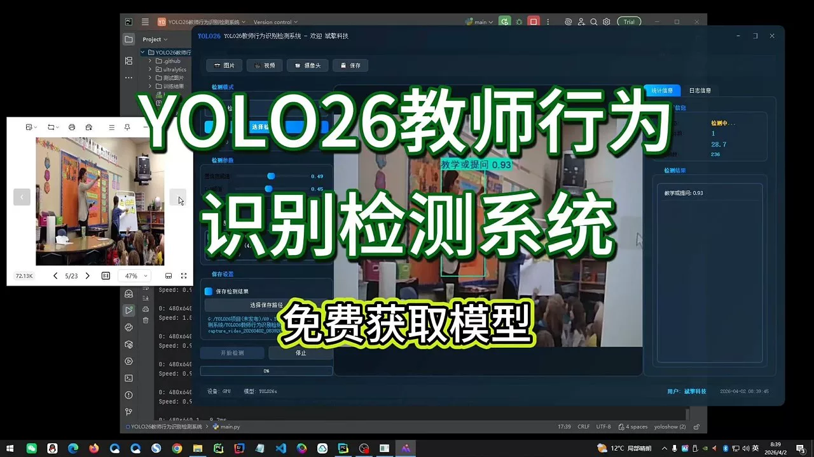
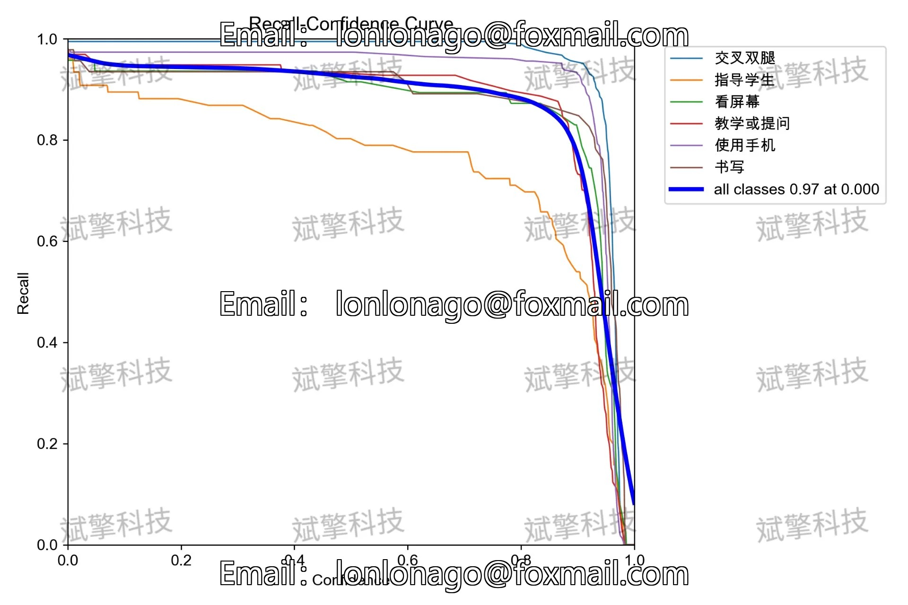
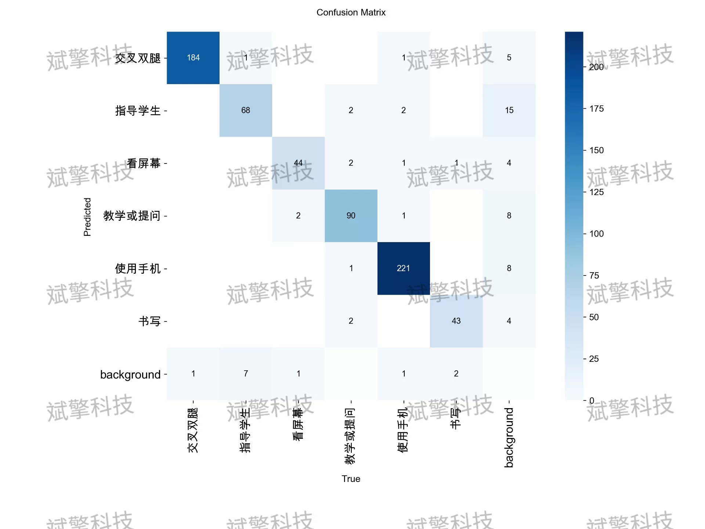
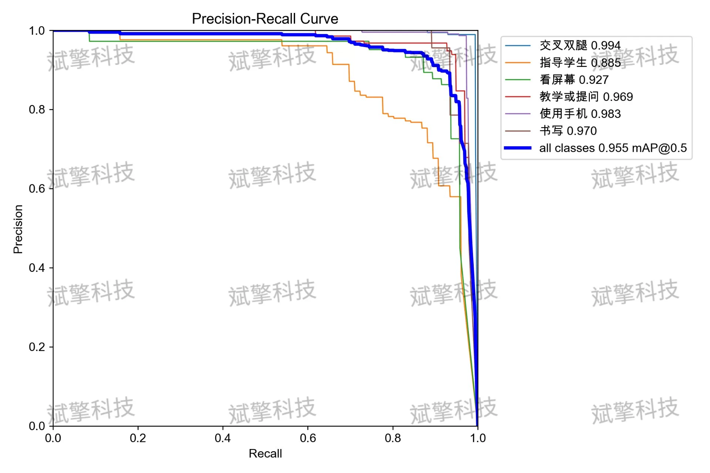
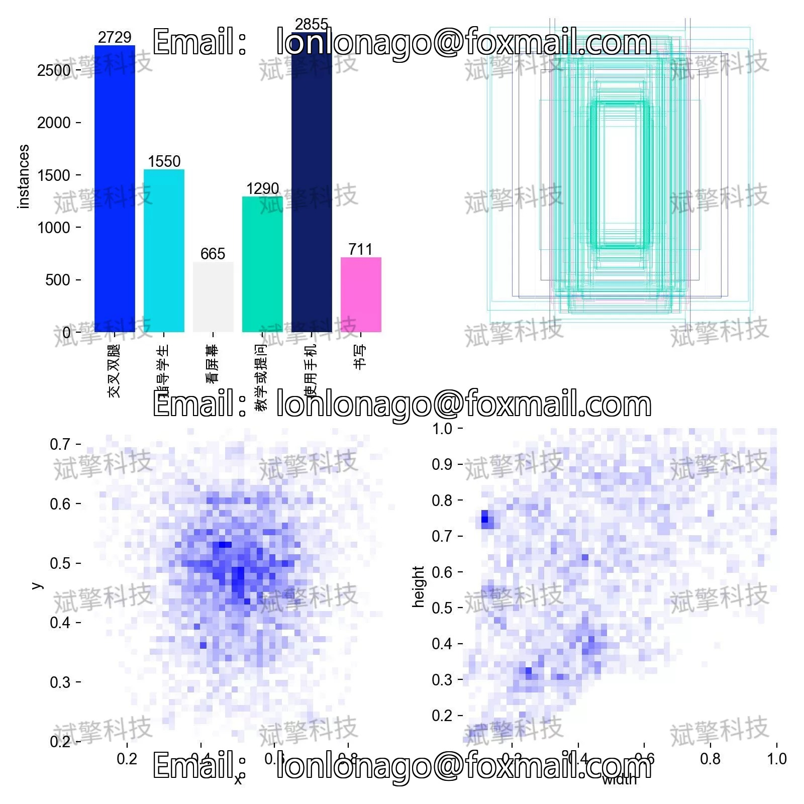
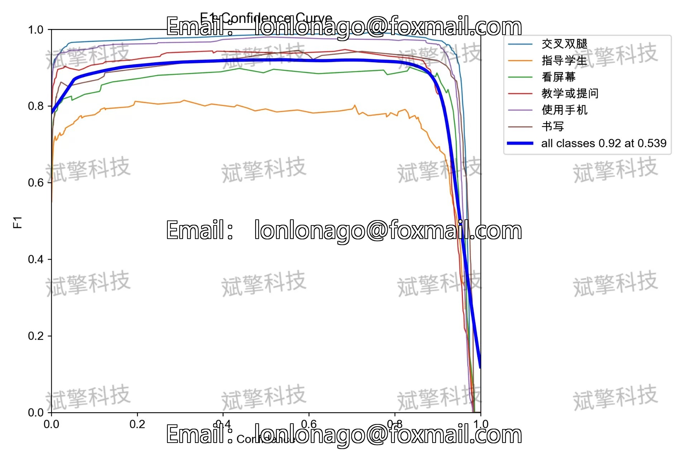
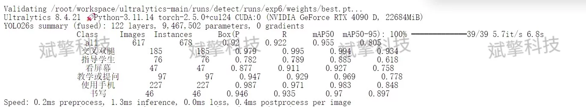
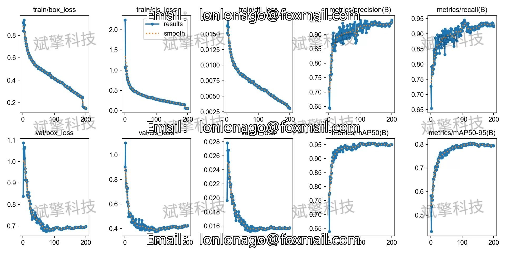
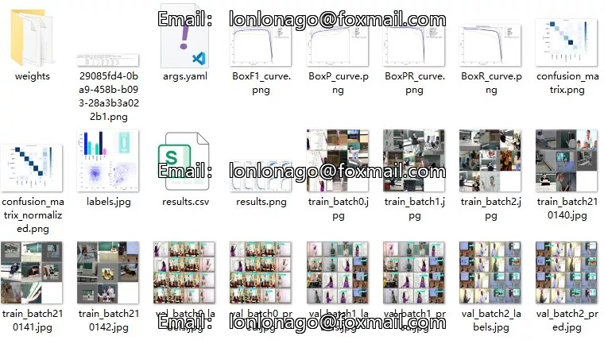

# YOLOv26 Teacher Behavior Detection System | Source Code + Model

## Body

YOLO26 Teacher Behavior Detection System | Source Code + Model Based on YOLO26 Deep Learning for Teacher Behavior Recognition Detection System (Project Source Code + Dataset + Model Weights + UI Interface + Python + Deep Learning + Remote Environment Deployment)

In the context of intelligent education, this paper proposes a teacher behavior detection system based on YOLO26. The system is designed around six typical teaching behaviors: crossing legs, guiding students, looking at the screen, teaching or asking questions, using a phone, and writing. A dedicated dataset is constructed to support these behaviors, and the YOLO26 object detection framework is used to achieve end-to-end behavior recognition. Experimental results show that the model achieved an mAP@0.5 of 0.955 on the validation set, with a preprocessing time of 0.2ms, inference time of 1.3ms, and post-processing time of 0.4ms per image, meeting real-time requirements. Among these six behaviors, "crossing legs," "using a phone," "teaching or asking," and "writing" all exceeded an mAP@0.5 of 0.96, while "guiding students" and "looking at the screen" were optimized as they are abstract actions or have blurred visual features, resulting in an mAP@0.5 of 0.885 and 0.927 respectively, making them the main directions for optimization in the current system. This study provides high precision and efficiency technical support for classroom behavior analysis, quality assessment of teaching, and intelligent supervision.

This study constructs a multi-category target detection dataset specifically for teacher behavior recognition, covering six typical classroom behaviors, as follows:
Crossing legs (crossing legs): The action of crossing legs when teachers sit down, often indicating relaxation or informal teaching states.
Guiding students (guiding students): One-on-one or group interactions between teachers and students, including crouching explanations, gesture guidance, eye contact, etc.
Looking at the screen (looking at the screen): Teachers gaze at projectors, computers, or interactive whiteboards, usually accompanied by teaching demonstrations or courseware operations.
Teaching or asking (teaching or asking): Teachers deliver lectures to the whole class, write explanations, or pose questions to students, representing the core of classroom leading behaviors.
Using a phone (using a phone): Teachers hold or operate phones, possibly for researching materials, recording information, or non-teaching purposes.
Writing (writing): Teachers write, draw, or mark on blackboards, whiteboards, or electronic devices, which are important ways of knowledge transmission.
Dataset size and division
Training set: 8843 images, used for model parameter learning and feature extraction.
Validation set: 617 images, used for hyperparameter tuning and model selection.
Test set: 360 images, used for final performance evaluation and generalization capability analysis.

Free remote installation appointment. Unsuccessful full refund.
Purchase comes with the following resources (auto unlock in Baidu Cloud):
YOLO recognition detection project complete source code
YOLO format dataset
Training code + UI interface code
Trained model + result images
Software installation package
Add WeChat to make a reservation for remote installation (automatically displayed WeChat ID after purchase) - Unsuccessful, full refund

⚙️ Core function modules
Detection capabilities
Image detection: upload and detect immediately, return detection boxes + category information
Video detection: supports video files, analyzes frames accurately
Camera real-time detection: connects USB cameras to monitor dynamically
Interaction and control
Target filtering: freely select one or more categories for detection
Parameter real-time adjustment: adjustable confidence threshold & IoU threshold, flexible control accuracy
Result saving: save images/videos/camera detection results in one click
System and data
User login registration: Supports password strength checking + encrypted storage
Log recording: automatically records operation and error information (with timestamp)

## Images

## Payment

Here is a pay link on Stripe ( https://buy.stripe.com/3cs8yP7sY87d0vu9AB ). Please contact me lonlonago@foxmail.com after funding $89, and I will send you a complete data files , thank you!

